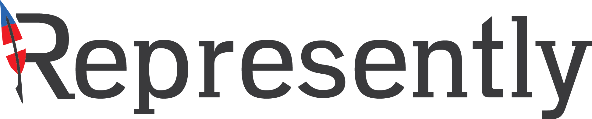

# #CivHacks17

## Introduction

Deloitte, General Assembly, and Represently are proud to partner to present #CivHacks17, a data-driven hackathon to discuss an analyze civic outcomes. Participants from various skill levels will form teams of 2-3 to create data-driven solutions ton one of the prompts of their choice. The goal of a hackathon (hacking marathon) is to ship **something** to production as soon as possible: mockups, visualizations, a prototype, etc that you believe accomplishes the goal. The aggressive time constraint means even the most technically skilled teams will need to be cognizant of setting reasonable boundries for their implementation.

## Project Overview

There are multiple projects you can work on to prove your data skill and make an impact. Select the one that most interests you, and pay attention to the judging criteria in executing your analysis.

### US Healthcare Data

> The Affordable Care Act (ACA) is the name for the comprehensive health care reform law and its amendments which addresses health insurance coverage, health care costs, and preventive care. The law was enacted in two parts: The Patient Protection and Affordable Care Act was signed into law on March 23, 2010 by President Barack Obama and was amended by the Health Care and Education Reconciliation Act on March 30, 2010.
> 
> This dataset provides health insurance coverage data for each state and the nation as a whole, including variables such as the uninsured rates before and after Obamacare, estimates of individuals covered by employer and marketplace healthcare plans, and enrollment in Medicare and Medicaid programs.
> How has the Affordable Care Act changed the rate of citizens with health insurance coverage? Which states observed the greatest decline in their uninsured rate? Did those states expand Medicaid program coverage and/or implement a health insurance marketplace? What do you predict will happen to the nationwide uninsured rate in the next five years?

Data source [here](https://www.kaggle.com/hhs/health-insurance) and [here](https://www.kaggle.com/hhs/health-insurance-marketplace). (Note: this dataset is quite large: justifying a 10% sample is acceptable.)

### Campaign Spending Data

ProPublica logs data on campaign expenditures per elections in the U.S.

Questions to consider: how are U.S. campaigns spending their funds? In the context of the 2016 election, are there notable anamolies in differences in spending? How may these have impacted electoral outcomes? Do some campaigns spend more on salaries, travel, rallies, etc?

A full metadata dictionary is available [here](http://classic.fec.gov/finance/disclosure/metadata/DisbursementCategoryCodes.shtml)

Download a cleaned set of the data from DataForDemocracy [here](https://data.world/data4democracy/propublica) (Note: This dataset does require a bit of additional cleaning, but this a good head start.)

### D.C. Rent Stabilization Data

> The Rent Stabilization Program (rent control) in the District of Columbia (DC Code § 42–3502.05) restricts the yearly rent increases that landlords can impose on tenants.
> 
> Rent stabilization covers all rental units except those for which an exemption applies. The primary exemptions are for government-owned buildings, for buildings whose building permit was issued in 1976 or later, and for owners who are not corporations and own four or fewer rental units in the District. Owners who reach voluntary agreements with their tenants can also be released from rent control, in return for other guarantees. These agreements usually protect the rent of current residents but not future residents.
> 
> There is, to our knowledge, no direct data on how many units are subject to rent control or which ones they are. Inferring that from public data is part of this project, as is modeling what the effect on rent control would be if aspects of the law were changed (such as changing the cut-off date of permits from 1976 to 1986).

Consider: what is the impact of rent control on D.C. housing markets? Is there a unified way to prove its impact? Are there policy recommendations you would make in response to your analysis?

Data (and much prior analysis) is available [here](https://github.com/codefordc/rent-stabilization).

### Bring Your Own Analysis (BYOA)

Don't like what you see here? Feel free to explore your own dataset, or bring your own project! The limits for doing so are boundless, which may be a benefit and a liability is such a time-constrained environment.

Perhaps you're interested in mining Twitter to see public reaction to policy, government expenditure data, transportation data, etc. If there's data for it, you can craft and answer your own analysis. Be sure if you select this prompt you are start a project fresh, not bringing something you're previously worked on.

## Schedule
 
- 8:30 AM: Check-In Opens
- 9:00 AM: Introductions
- 9:45 AM: Teams Form
- 10:00 AM: Hacking Begins
- 12:30 PM: Lunch
- 2:30 PM: Overview of Analytics @ Deloitte
- 5:30 PM: Hacking Concludes; Dinner
- 6:15 PM: Judging Begins
- 7:45 PM: Deliberation
- 8:00 PM: Winners Announced; Closing

## Deliverable
Every team will present a 6 minute pitch (you will be cut off!) on their findings to the judges panel at 6:15 PM. 

Presentations must include:

- A proven data analysis of contextualizing your data, visualizations, and actionable next steps
- Recommendations for what you believe would help solve an identified problem and be a reasonable next step in your analysis.

## Teams
Teams are three to four people. Given the data analysis, user experience, and (potentially live) deployment component of your task, including a diversity of skillsets should be a priority. A team that has fully deployed interactive data visualization components may provide impressive analysis, but will lack recommendations for improving the experience to end users seeking additional study abroad information. Likewise, well-researched and prototyped solutions that lack data-inforced findings (particularly of the provided visa dataset) will lack quantitative validity.

## Submissions
Submissions must be submitted via pull request to the submissions folder by 5:30 PM.

To submit, create a folder within the submission folder with your team name. In that folder, place your submission materials. All submissions must include the presentation materials your group is leveraging, whether this ranges from a PDF of a PPT to links (in a mardown file) to working prototypes and deployed visualization tools. (Bear in mind you cannot add files in excess of 100MB to your Github: you should save your presentation as a PDF)

If you need help with pull requests, find Joseph in advance of the 5:30 PM deadline. Please also view this [resource](https://yangsu.github.io/pull-request-tutorial/)

## Judging Criteria
  
### Creativity
Is the given project a unique approach to solving the problem? Is the solution structured in a previously unconsidered manner? Are the findings innovative?

### Implementation
Did the team create a workable dashboard, actionable visualizations, or clear value for next steps?
 
### Feasibility
Could the given proposed demo solution be scaled out to a broader use case?
 
 
### Visualization / UX
Are findings presented in a visually appealing manner? Are the data visualizations clean and approachable? Is the prototype easy to use and friendly to the end user?
 
1                              	2                              	3                              	4                              	5
 
Comments:
 

The criteria is available [here](judging.md).

## Deloitte Info Sessions

There will be a Deloitte Info Session at 2:30. Attend if you would like further information about the analytics practice at Deloitte

## Partners

